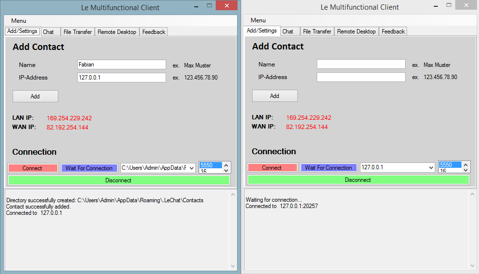
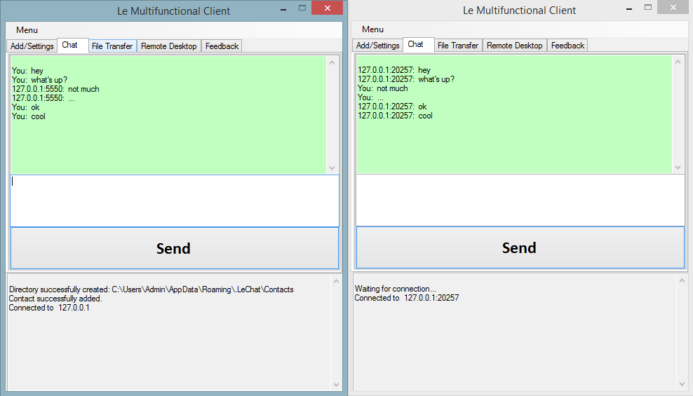

# About project
### Quality: **hacky**
### Year of creation: 2012

## Scale of quality
**professional**
maintainable, scalable and performing -> well thought out architecture, clean structure, complete documentation

**prototyping**
maintainable and scalable to a certain extent -> rough architecture, clean structure, readable

**OK**
maintainable -> clean structure, readable

**hacky**
just good enough to run

# P2P Chat
A P2P chat program I've built with C# using Windows Forms and the TCP-IP stack for fun and to learn programming.

